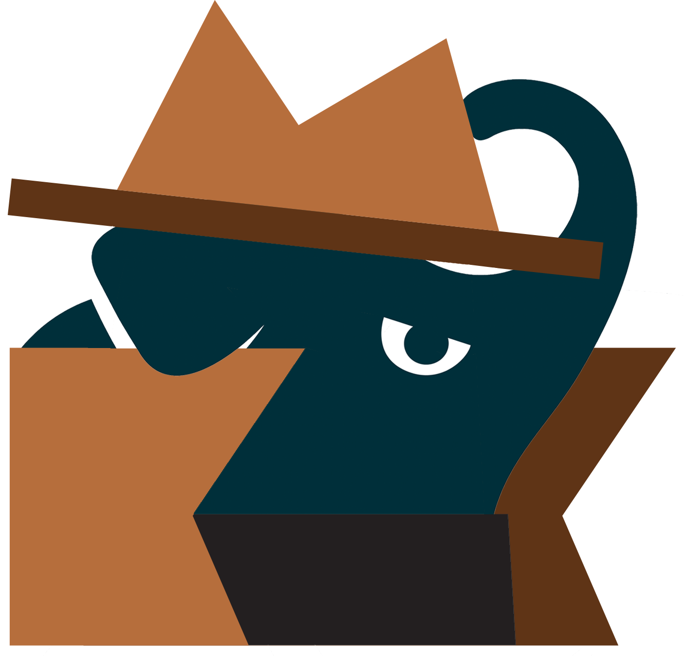

<div style="text-align: center;">
  
  <h1><strong>Shadow Gradle Plugin</strong></h1>
</div>

# Introduction

Shadow is a Gradle plugin for combining a project's dependency classes and resources into a single
output Jar.
The combined Jar is often referred to a _fat-jar_ or _uber-jar_.
Shadow utilizes [`JarInputStream`](https://docs.oracle.com/javase/8/docs/api/java/util/jar/JarInputStream.html) and [`JarOutputStream`](https://docs.oracle.com/javase/8/docs/api/java/util/jar/JarOutputStream.html) to efficiently process dependent libraries
into the output jar without incurring the I/O overhead of expanding the jars to disk.

!!! warning "Plugin ID Change"

    Previously this plugin was developed by [@johnrengelman](https://github.com/johnrengelman) and published under the ID [
    `com.github.johnrengelman.shadow`](https://plugins.gradle.org/plugin/com.github.johnrengelman.shadow)
    before maintenance was transferred to the [GradleUp organization](https://github.com/GradleUp) to ensure future
    development, see [#908](https://github.com/GradleUp/shadow/issues/908).
    
    If you are still using the old plugin ID in your build script, we recommend to switch to the new plugin ID [
    `com.gradleup.shadow`](https://plugins.gradle.org/plugin/com.gradleup.shadow)
    and update to the latest version to receive all the latest bug fixes and improvements.

## Benefits of Shadow

Shadowing a project output has 2 major use cases:

1. Creating an _executable_ JAR distribution
2. Bundling and relocating common dependencies in libraries to avoid classpath conflicts

### Executable Distributions

Executable distribution is the main use case for deploying an _application_ that can be executed/run in the runtime
environment.
In the case of Shadow, this is a single _uber_ or _fat_ JAR.
The JAR file contains all the application code and dependent libraries to execute (not including the standard JVM
libraries).
The shadow JAR does **not** include the JRE itself.
It must be available on the target system.

Executable JARs contain a JAR MANIFEST that specifies the application Main Class.
This allows the application to be started with a single command:

```shell
java -jar application-shadow.jar
```

### Library Bundling

Dependency bundling and relocation is the main use case for _library_ authors.
The goal of a bundled library is to create a pre-packaged dependency for other libraries or applications to utilize.
Often in these scenarios, a library may contain a dependency that a downstream library or application also uses.
In _some_ cases, different versions of this common dependency can cause an issue in either the upstream library or
the downstream application.
These issues often manifest themselves as binary incompatibilities in either the library or application code.

By utilizing Shadow's ability to _relocate_ the package names for dependencies, a library author can ensure that the
library's dependencies will not conflict with the same dependency being declared by the downstream application.
