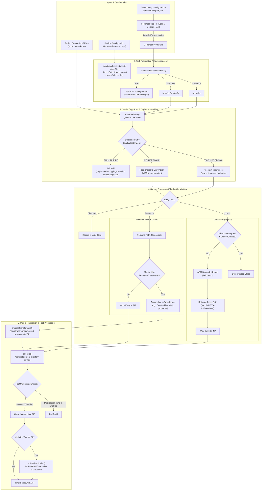

# Configuring Shadow

The [`ShadowJar`][ShadowJar] task type extends from Gradle's [`Jar`][Jar] type.
This means that all attributes and methods available on [`Jar`][Jar] are also available on [`ShadowJar`][ShadowJar].

## ShadowJar Execution Flow

The following diagram and breakdown illustrate how the `shadowJar` task processes inputs from dependency configurations and source files to the final shadowed output JAR:



### Execution Lifecycle Breakdown

1. **Input Resolution & Filtering**:
    - **Configurations**: Shadow resolves dependencies from configured configurations (such as `runtimeClasspath`).
    - **Dependency Filtering**: The [`dependencies`][DependencyFilter] block (`include`/`exclude`) filters artifacts before merging, producing `includedDependencies`.
    - **Unmerged Dependencies**: Dependencies added to `configurations.shadow` are not bundled into the JAR; instead, their file names are added to the `Class-Path` manifest attribute.
    - **Extra Inputs**: Additional files or directories can be included via standard [`from(...)`][Jar.from] calls.

2. **Task Preparation (`ShadowJar.copy()`)**:
    - **`addIncludedDependencies()`**: Analyzes each dependency file:
        - Regular JAR/ZIP files are unpacked and added as copy specs via `archiveOperations.zipTree(jar)`.
        - Directories are added via `from(dir)`.
        - AAR files are rejected with a helpful error suggesting the Android Fused Library plugin.
    - **`injectManifestAttributes()`**: Populates the JAR manifest with `Main-Class` (if specified), `Class-Path` (from `configurations.shadow`), and checks dependencies for `Multi-Release: true` to inject the `Multi-Release` attribute if enabled.

3. **Gradle `CopySpec` & `duplicatesStrategy` Intervention**:
    - File-level `include` and `exclude` pattern filters are evaluated.
    - **Duplicate Handling**: Gradle's `duplicatesStrategy` operates at the `CopySpec` layer **before** entries reach Shadow's transformers or relocators:
        - `EXCLUDE` (default): Only the first occurrence of a file path is kept. Subsequent duplicates are dropped by Gradle and will **not** reach [`ResourceTransformer`][ResourceTransformer]s.
        - `INCLUDE` / `WARN`: Allows duplicate files to pass through to the `CopyAction` so [`ResourceTransformer`][ResourceTransformer]s can aggregate and merge them.
        - See [Handling Duplicates Strategy](merging/README.md#handling-duplicates-strategy) for best practices on combining `duplicatesStrategy` and transformers.

4. **Stream Processing (`ShadowCopyAction`)**:
    - **Class Files (`*.class`)**:
        - *Dependency Analyzer Minimization*: If minimization with `MinimizeTool.DEPENDENCY_ANALYZER` is enabled, unused classes are identified and dropped.
        - *Relocation & Remapping*: ASM remappers rewrite bytecode references according to configured [`relocators`][Relocator] and auto-relocation rules.
        - *Path Relocation*: The class path is relocated (including handling Multi-Release version prefixes under `META-INF/versions/`) and written to the ZIP stream.
    - **Resource & Other Files**:
        - *Path Relocation*: Relocates resource paths matching configured relocators.
        - *Resource Transformers*: Checks if a registered [`ResourceTransformer`][ResourceTransformer] matches the file (`canTransformResource`). If matched, the file stream is passed to the transformer (`transform`) to buffer and merge in memory.
        - *Unmatched Resources*: Written directly to the ZIP output stream.
    - **Directories**: Tracked in memory to generate required parent directory entries.

5. **Output Finalization**:
    - **`processTransformers()`**: Calls `modifyOutputStream` on all active [`ResourceTransformer`][ResourceTransformer]s, writing merged contents (e.g. `META-INF/services/`, merged properties, appended files, XML) into the ZIP stream.
    - **`addDirs()`**: Creates synthetic directory entries in the ZIP for proper archive structure.
    - **`checkDuplicateEntries()`**: If [`failOnDuplicateEntries`][ShadowJar.failOnDuplicateEntries] is enabled, verifies that no duplicate entry names exist in the final output ZIP, failing the build or logging a warning if any duplicates are found.
    - The intermediate ZIP output stream is closed.

6. **Post-Processing Optimization (R8 Minimization)**:
    - If minimization is configured with `MinimizeTool.R8`, Shadow invokes R8 on the intermediate JAR.
    - R8 applies ProGuard/keep rules, treeshaking, and optimization, outputting the final optimized fat JAR.


## Configuring Output Name

Shadow configures the default [`ShadowJar`][ShadowJar] task to set the output JAR's

- [`archiveAppendix`][archiveAppendix]
- [`archiveBaseName`][archiveBaseName]
- [`archiveExtension`][archiveExtension]
- [`archiveFile`][archiveFile]
- [`archiveFileName`][archiveFileName]
- [`archiveVersion`][archiveVersion]
- [`destinationDirectory`][destinationDirectory]

to the same default values as Gradle does for all [`Jar`][Jar] tasks. Additionally, it configures the
[`archiveClassifier`][archiveClassifier] to be `all`. The listed ones are not full, you can view all the properties in
[`Jar`][Jar]. The output shadowed JAR file will be named with the following format:

```
archiveBaseName-$archiveAppendix-$archiveVersion-$archiveClassifier.$archiveExtension
```

If working with a Gradle project with the name `myApp` and version `1.0`, the default [`ShadowJar`][ShadowJar] task will
output a file at: `build/libs/myApp-1.0-all.jar`. You can override the properties listed above to change the output name
of the shadowed JAR file. e.g.

=== "Kotlin"

    ```kotlin
    tasks.shadowJar {
      archiveVersion = ""
    }
    ```

=== "Groovy"

    ```groovy
    tasks.named('shadowJar', com.github.jengelman.gradle.plugins.shadow.tasks.ShadowJar) {
      archiveVersion = ''
    }
    ```

This will result in the output file being named `myApp-all.jar` instead of `myApp-1.0-all.jar`.

## Configuring the Runtime Classpath

Each Java JAR file contains a manifest file that provides metadata about the contents of the JAR file itself.
When using a shadowed JAR file as an executable JAR, it is assumed that all necessary runtime classes are contained
within the JAR itself.
There may be situations where the desire is to **not** bundle select dependencies into the shadowed JAR file, but
they are still required for runtime execution.

In these scenarios, Shadow creates a `shadow` configuration to declare these dependencies.
Dependencies added to the `shadow` configuration are **not** bundled into the output JAR.
Think of `configurations.shadow` as unmerged, runtime dependencies.
The integration with the [`maven-publish`][maven-publish] plugin will automatically configure dependencies added
to `configurations.shadow` as `RUNTIME` scope dependencies in the resulting POM file.

Additionally, Shadow automatically configures the manifest of the [`ShadowJar`][ShadowJar] task to contain a
`Class-Path` entry in the JAR manifest.
The value of the `Class-Path` entry is the name of all dependencies resolved in the `shadow` configuration for the
project.

=== "Kotlin"

    ```kotlin
    dependencies {
      shadow("junit:junit:3.8.2")
    }
    ```

=== "Groovy"

    ```groovy
    dependencies {
      shadow 'junit:junit:3.8.2'
    }
    ```

Inspecting the `META-INF/MANIFEST.MF` entry in the JAR file will reveal the following attribute:

```property
Class-Path: junit-3.8.2.jar
```

!!! important

    When deploying a shadowed JAR as an execution JAR, any non-bundled runtime dependencies **must** be deployed in the location specified in the `Class-Path` entry in the manifest.

## Configuring the JAR Manifest

The [`ShadowJar`][ShadowJar] manifest is configured in a number of ways. First, the manifest for the `shadowJar` task
is configured to __inherit__ from the manifest of the standard `jar` task.

=== "Kotlin"

    ```kotlin
    tasks.jar {
      manifest {
        attributes["Main-Class"] = "my.Main"
      }
    }
    ```

=== "Groovy"

    ```groovy
    tasks.named('jar', Jar) {
      manifest {
        attributes 'Main-Class': 'my.Main'
      }
    }
    ```

Inspecting the `META-INF/MANIFEST.MF` entry in the JAR files will reveal the following attribute:

```property
Main-Class: my.Main
```

If it is desired to merge a manifest from another [`Jar`][Jar] task, the `manifest.from` methods can be used to
configure the upstream.

=== "Kotlin"

    ```kotlin
    val testJar = tasks.register<Jar>("testJar") {
      manifest {
        attributes["Description"] = "This is an application JAR"
      }
    }

    tasks.shadowJar {
      manifest.from(testJar.get().manifest)
    }
    ```

=== "Groovy"

    ```groovy
    def testJar = tasks.register('testJar', Jar) {
      manifest {
        attributes 'Description': 'This is an application JAR'
      }
    }

    tasks.named('shadowJar', com.github.jengelman.gradle.plugins.shadow.tasks.ShadowJar) {
      manifest.from testJar.get().manifest
    }
    ```

## Adding Multi-Release Manifest Attribute

The [`ShadowJar`][ShadowJar] task can automatically add the `Multi-Release` attribute to the JAR manifest if any of
the included dependencies contain this attribute. This is controlled by the `addMultiReleaseAttribute` property.

By default, `addMultiReleaseAttribute` is set to `true`. When enabled, Shadow will scan all dependencies being merged
into the shadow JAR. If any dependency JAR has the `Multi-Release` manifest attribute set to `true`, Shadow will add
`Multi-Release: true` to the manifest of the resulting shadow JAR.

You can disable this behavior by setting `addMultiReleaseAttribute` to `false`:

=== "Kotlin"

    ```kotlin
    tasks.shadowJar {
      addMultiReleaseAttribute = false
    }
    ```

=== "Groovy"

    ```groovy
    tasks.named('shadowJar', com.github.jengelman.gradle.plugins.shadow.tasks.ShadowJar) {
      addMultiReleaseAttribute = false
    }
    ```

This is useful if you want to control the presence of the `Multi-Release` attribute manually or avoid inheriting it
from dependencies.

## Adding Extra Files

The [`ShadowJar`][ShadowJar] task is a subclass of the [`Jar`][Jar] task, which means that the[`Jar.from`][Jar.from]
method can be used to add extra files.

=== "Kotlin"

    ```kotlin
    tasks.shadowJar {
      from("Foo") {
        // Copy Foo file into Bar/ in the shadowed JAR.
        into("Bar")
      }
    }
    ```

=== "Groovy"

    ```groovy
    tasks.named('shadowJar', com.github.jengelman.gradle.plugins.shadow.tasks.ShadowJar) {
      from('Foo') {
        // Copy Foo file into Bar/ in the shadowed JAR.
        into('Bar')
      }
    }
    ```

See also [Embedding Local Jar Files Into Your Shadowed Jar](dependencies/README.md#embedding-local-jar-files-into-your-shadowed-jar).


[Jar.from]: https://docs.gradle.org/current/dsl/org.gradle.jvm.tasks.Jar.html#org.gradle.jvm.tasks.Jar:from(java.lang.Object,%20org.gradle.api.Action)
[Jar]: https://docs.gradle.org/current/dsl/org.gradle.api.tasks.bundling.Jar.html
[ShadowJar]: ../api/shadow/com.github.jengelman.gradle.plugins.shadow.tasks/-shadow-jar/index.html
[ShadowJar.failOnDuplicateEntries]: ../api/shadow/com.github.jengelman.gradle.plugins.shadow.tasks/-shadow-jar/fail-on-duplicate-entries.html
[DependencyFilter]: ../api/shadow/com.github.jengelman.gradle.plugins.shadow.tasks/-dependency-filter/index.html
[Relocator]: ../api/shadow/com.github.jengelman.gradle.plugins.shadow.relocation/-relocator/index.html
[ResourceTransformer]: ../api/shadow/com.github.jengelman.gradle.plugins.shadow.transformers/-resource-transformer/index.html
[application]: https://docs.gradle.org/current/userguide/application_plugin.html
[archiveAppendix]: https://docs.gradle.org/current/dsl/org.gradle.api.tasks.bundling.Jar.html#org.gradle.api.tasks.bundling.Jar:archiveAppendix
[archiveBaseName]: https://docs.gradle.org/current/dsl/org.gradle.api.tasks.bundling.Jar.html#org.gradle.api.tasks.bundling.Jar:archiveBaseName
[archiveClassifier]: https://docs.gradle.org/current/dsl/org.gradle.api.tasks.bundling.Jar.html#org.gradle.api.tasks.bundling.Jar:archiveClassifier
[archiveExtension]: https://docs.gradle.org/current/dsl/org.gradle.api.tasks.bundling.Jar.html#org.gradle.api.tasks.bundling.Jar:archiveExtension
[archiveFileName]: https://docs.gradle.org/current/dsl/org.gradle.api.tasks.bundling.Jar.html#org.gradle.api.tasks.bundling.Jar:archiveFileName
[archiveFile]: https://docs.gradle.org/current/dsl/org.gradle.api.tasks.bundling.Jar.html#org.gradle.api.tasks.bundling.Jar:archiveFile
[archiveVersion]: https://docs.gradle.org/current/dsl/org.gradle.api.tasks.bundling.Jar.html#org.gradle.api.tasks.bundling.Jar:archiveVersion
[destinationDirectory]: https://docs.gradle.org/current/dsl/org.gradle.api.tasks.bundling.Jar.html#org.gradle.api.tasks.bundling.Jar:destinationDirectory
[maven-publish]: https://docs.gradle.org/current/userguide/publishing_maven.html
